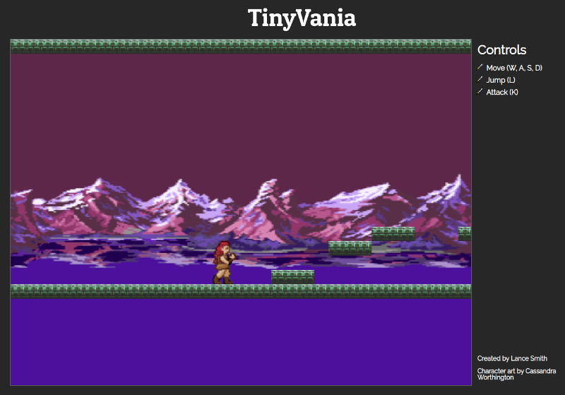

# **TinyVania**
_A tiny Castlevania-inspired game_

## **Overview**

TinyVania is a 2D sidescroller where you play as a monster hunter completing levels while traversing dangerous terrain filled with monsters. The main controls will allow you to move left and right, jump, and attack.



A level will start with some simple obstacles to overcome and easy monsters to defeat. Later the platforming and monsters will become more difficult.

Two of my all-time favorite games are similar in style. ([Super Metroid](https://en.wikipedia.org/wiki/Super_Metroid), [CastleVania Symphony of the Night](https://en.wikipedia.org/wiki/Castlevania:_Symphony_of_the_Night)) I grew up playing these and would love to make some of my own.

This game is inspired by [CastleVania](https://en.wikipedia.org/wiki/Castlevania), a series of games dating back to the 80's. They are typically 2D sidescrolling games where you play as a hero with a sword or whip and fight monsters. The first games had a linear level-based progression.

## **Functionality**

* Level creation
  * Game logic is able to generate the level based on a user created text file
  * Starting the game will spawn the player in the level
* Player controls
  * Player object respond to player input (left, right, jump, attack) through JavaScript event handlers
* Animated sprites
  * Player and enemies animate between sprites when moving, idling, or reacting
* Physics & Collision
  * Player is affected by gravity and colliding with obstacles
  * Collision detection for players attacking enemies and vice versa

```javascript
//calculate velocity for falling
applyVelocity(deltaT) {
  const timeAdj = 0.01;
  this.pos.y += (this.vel.y * (deltaT * timeAdj));
  this.pos.x += this.vel.x;

  this.vel.y += (globals.gravity * (deltaT * timeAdj));
  if (this.vel.y > globals.maxVelocity) this.vel.y = globals.maxVelocity;
}

//calculate collisions with sprite boxes
bCollided(box2) {
  let box1 = this;

  if ((box1.pos.x <= (box2.pos.x + box2.size.w)) &&
    ((box1.pos.x + box1.size.w) >= box2.pos.x) &&
    (box1.pos.y <= (box2.pos.y + box2.size.h)) &&
    ((box1.pos.y + box1.size.h) >= box2.pos.y)) {
    return true;
  }
  return false;
}
```

* Game win & loss states
  * Player can die from damage and reset game
  * Win state achieved at end of level

## **Architecture & Technologies**

* Controls
  * This is achieved through JavaScript event listeners. Each listens for a specific keypress that will alter a JavaScript object that represents the state of the player's controller. The game logic then applies the appropriate actions to the player game object.

* Rendering
  * Rendering the game and sprite assets is achieved through HTML canvas. An object is built that holds a reference to every game object that should be rendered each frame. The main game loop iterates through this object, drawing each object on the screen.

* Game logic
  * This is handled in vanilla JavaScript. There will be a master Game object spawned on load that will manage all game functionality and hold references to important objects like the level, player, and other game logic.

* Script bundling
  * Webpack for loading all scripts and bundling assets into one directory. This makes the project easier to maintain as assets and scripts are added.
