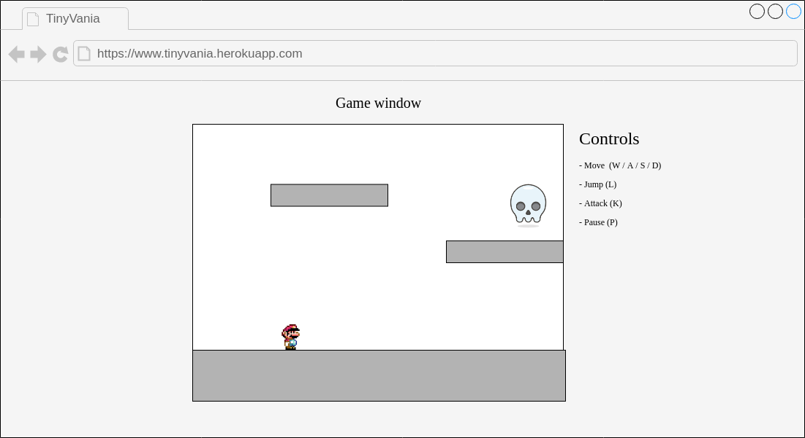

# **TinyVania**
_A tiny Castlevania-inspired game_

## **Overview**

TinyVania is a 2D sidescroller where you play as a monster hunter completing levels while traversing dangerous terrain filled with monsters. The main controls will allow you to move left and right, jump, and attack.

A level will start with some simple obstacles to overcome and easy monsters to defeat. Later the platforming and monsters will become more difficult.

Two of my all-time favorite games are similar in style. ([Super Metroid](https://en.wikipedia.org/wiki/Super_Metroid), [CastleVania Symphony of the Night](https://en.wikipedia.org/wiki/Castlevania:_Symphony_of_the_Night)) I grew up playing these and would love to make some of my own.

This game is inspired by [CastleVania](https://en.wikipedia.org/wiki/Castlevania), a series of games dating back to the 80's. They are typically 2D sidescrolling games where you play as a hero with a sword or whip and fight monsters. The first games had a linear level-based progression.

## **Functionality/MVPs**

* Level creation
  * Game logic will be able to load a level from some other format that is easy to assemble
  * Starting the game will spawn the player in the level
* Player controls
  * Player object will respond to player input (left, right, jump, attack)
* Animated sprites
  * Player and enemies should animate between at least a few sprites when moving
* Physics & Collision
  * Player will be affected by gravity and colliding with obstacles
  * Collision detection for players attacking enemies and vice versa
* Game win & loss states
  * Player can die from damage and reset game
  * Win state achieved at end of level

### **Bonus functionality**

* Audio
  * SFX & music while playing the game
* Boss battle
  * A more difficult monster with more complex behavior blocking the end of the level

## **Architecture & Technologies**

* Controls
This should all be achievable through plain JavaScript by setting up event listeners. There will be a state for player control that various keypresses will alter.

* Rendering
Rendering the game and sprite assets should all be done through HTML canvas.

* Audio
Web Audio API will handle playback of sound effects and any music I may have.

* Game logic
This will all be handled in vanilla JavaScript.

* Script bundling
Webpack for loading all scripts.

## **Dev Schedule**

### Day 1
* Review a/A materials relevant to project
* Project setup
* Load a level on screen
* Spawn player object

### Day 2
* Player controls (make it move, jump, attack)
* Animate sprites for player

### Day 3
* Get basic collision working (gravity, player <=> enemies)
* Game win/loss states

### Day 4
* Design a level or two
* Polish (SFX, music, arts)

## Wireframe

